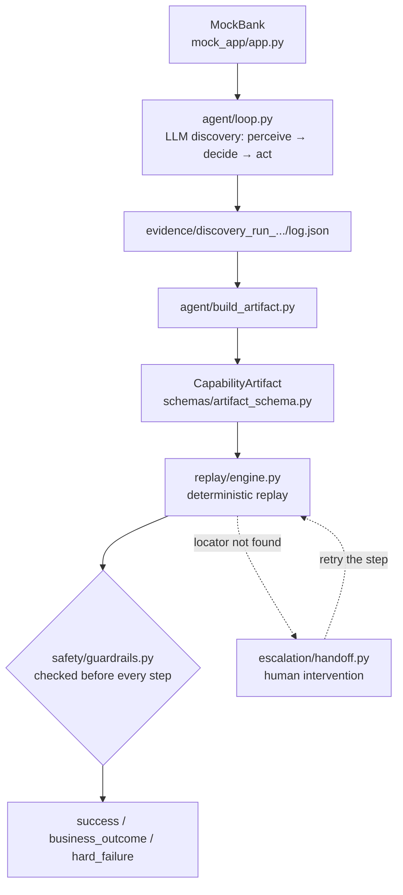
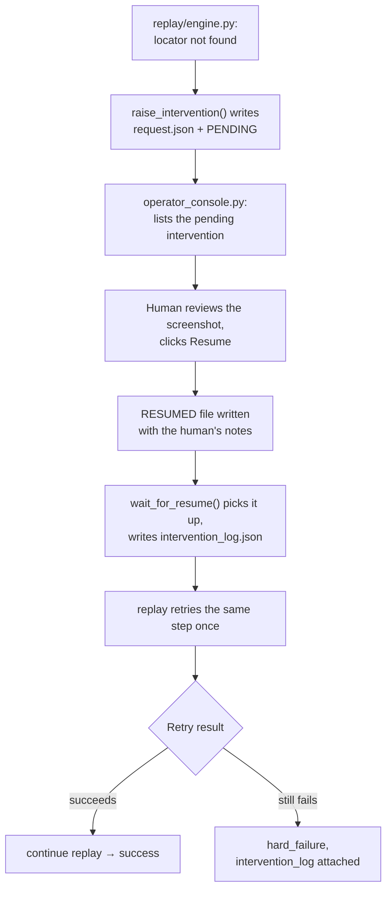

# computer-use-automation — Report

## 1. Architecture

The system is a pipeline of independent stages, all exercised against
**MockBank**, a small Flask app (`mock_app/app.py`) with no `id`/`class`/
`data-testid` attributes, no JS, and legacy `<table>` layout — forcing locator
strategies that don't rely on clean test hooks.

### Pipeline overview

### Components

- **`agent/loop.py`** — the LLM discovery agent, running `perceive → decide →
  act`. `perceive(page)` reads the page purely via DOM queries
  (`page.locator("body").inner_text()` for a text summary, plus a
  `page.evaluate()` script walking `input`/`select`/`button`/`a` elements) and
  returns `{url, visible_text_summary, inputs, buttons, links}` — never a
  screenshot. `decide()` sends that state, the goal, and step history to
  `gpt-4o-mini` (fallback `gpt-4o`) via structured outputs into a `Decision`
  Pydantic model, with one retry on a malformed response. `act()` resolves the
  chosen element back onto the live page and performs it.
- **`schemas/artifact_schema.py`** — the Pydantic `CapabilityArtifact` model a
  successful discovery run gets converted into.
- **`agent/build_artifact.py`** — converts a discovery run's `log.json` into a
  `CapabilityArtifact`, lifting hardcoded values into named, typed inputs.
- **`replay/engine.py`** — executes a `CapabilityArtifact` deterministically;
  contains no LLM call anywhere.
- **`safety/guardrails.py`** — a domain/route/action-type allowlist plus a
  risky-action policy, consulted before every replay step.
- **`escalation/handoff.py` + `operator_console.py`** — pause a stuck replay
  run and hand it to a human.

### Key trade-off: text/DOM perception over screenshots

`perceive()` never gives the LLM an image, for three reasons:

- **Cost** — a text summary is a few hundred tokens vs. a materially pricier
  vision-model screenshot, across ~10 steps per discovery run.
- **Reliability** — MockBank has no `id`/`for` attributes, so an input's
  "label" only exists as the preceding `<td>` text in its `<tr>`. That's
  trivial to compute from the DOM but not something a screenshot, or even
  standard accessibility-tree name computation, reconstructs for label-less
  table markup — we wrote a custom `label_for()` heuristic (mirrored in
  `agent/loop.py`, `replay/engine.py`, and `agent/build_artifact.py`) that
  walks preceding table cells.
- **Coherence** — the same visible text the agent reads is exactly what
  `act()`, and later the replay engine's `strategy: "visible_text"`/
  `"label_text"` locators, key off of, so nothing is lost translating "what
  the agent saw" into "what the artifact records."

### Single-process, synchronous architecture

Everything runs as a plain script or Flask dev server — no task queue, no
async loop, no multi-worker deployment — matching the actual scope of one
discovery or replay run at a time, locally. Synchronous Playwright plus a
blocking `wait_for_resume()` poll is simpler to reason about and test than an
async equivalent; concurrency would only matter for running many artifacts
across many tenants at once (Section 4).

## 2. Artifact schema

`CapabilityArtifact` (`schemas/artifact_schema.py`) has five parts:

- **Metadata**: `artifact_id`, `version`, `description`, `target_app`,
  optional `created_from_discovery_run` for traceability back to its source run.
- **Typed `inputs: dict[str, InputParameter]`** (`type`, `required`, optional
  `enum`, optional `constraints` like `min`/`max`).
  *Why*: lets `replay._validate_inputs()` reject a bad call — negative
  deposit, unknown account type, missing member ID — before a browser opens,
  turning a mid-run failure into an immediate, zero-cost `invalid_input`.
- **Ordered `steps`**: each has a `step_id`, an `action`, and action-specific
  fields enforced by a per-action rule table (`click` can't carry
  `value_from_input`; `type` must have both `locator` and `value_from_input`).
  Interactive steps carry a `Locator` with a `primary` and optional `fallback`
  strategy.
  *Why layered locators*: a legacy app has no stable `id`s; one strategy
  breaks the moment wording shifts slightly — a fallback buys a second chance
  before the engine has to stop and ask a human.
- **`verify_checkpoint` steps** carry a `condition` and `on_fail`, either
  `"business_outcome:<name>"` or `"hard_failure"`.
  *Why*: separates an expected negative business result (member not found)
  from the automation itself breaking (a button vanished) — conflating the
  two makes every real bug look like routine variation, or vice versa.
- **Declared `outputs`** (`extract_from: {strategy, label}`) and a top-level
  `success_condition`.
  *Why*: decouples the artifact from any one discovery run's raw transcript —
  a caller only needs to know an artifact produces a `reference_number`, not
  which LLM steps produced it.

**Validation**: step_ids must be unique/sequential, and every
`value_from_input` must resolve to a declared input key — both raise
`pydantic.ValidationError` at construction time. `schemas/test_artifact_schema.py`
(5 tests) covers a valid artifact round-tripping through JSON and both
validation failures.

## 3. Determinism & error handling

`replay/engine.py` never calls an LLM. `navigate` is `base_url + target`;
`type`/`select` resolve via the same DOM label heuristic (primary, then
fallback); `click` resolves via `get_by_role(name=...)`, case-insensitive
substring matching by default. Given the same artifact, inputs, and app
state, the sequence of Playwright calls is identical every run.

### The six possible statuses

| Status | Trigger |
|---|---|
| `invalid_input` | Pre-flight input validation failed (type/required/enum/min-max) — no browser opened. |
| `blocked_by_policy` | `check_allowlist()` rejected the route, domain, or action type. |
| `requires_confirmation` | A risky step (e.g. the Submit click) was attempted without `confirmed: true`. |
| `business_outcome` | A `verify_checkpoint` failed with `on_fail: business_outcome:<name>`. |
| `success` | All steps completed, the final `success_condition` held, and every declared output was extracted. |
| `hard_failure` | Everything else: a checkpoint failed with `on_fail: hard_failure`, a locator resolved via neither strategy (after one escalation retry, Section 5), the final check didn't hold, or any unexpected exception was caught and formatted. Always carries `step`, `expected`, `observed` (~200 chars of actual page text), and `screenshot`. |

### Actual test evidence

(`replay/test_engine.py`, all passing live against MockBank):

- Replaying member `10003`/Savings — never used during discovery, which used
  `10001` — returns `success` with a `reference_number` starting `"REF-"`,
  confirmed by reading the confirmation screenshot back.
- Member `99999` returns `business_outcome`/`member_not_found`.
- A `-10` deposit returns `invalid_input`.
- A manually built broken-locator artifact produced a `hard_failure` naming
  the exact step and locator tried
  (`"no button/link found for locator (primary=visible_text:'ThisButtonDoesNotExist')"`),
  confirming raw errors never leak unformatted.

## 4. Heterogeneity & multi-tenant (design only — not built)

### Legacy web apps

MockBank already exercises the hard case: no `id`/`class`, table layout,
labels inferred only by DOM proximity. A frameset-heavy enterprise app
extends this directly — the same `Locator{primary, fallback}` shape and
proximity heuristic apply; framesets just need `perceive()`/the replay engine
to iterate `page.frames`, a mechanical extension of
`_find_input_by_text`/`_find_clickable_by_text`, not a schema change.

### Desktop apps

`{strategy, value}` doesn't mention Playwright or the DOM at all. A desktop
replay engine would swap Playwright for an OS accessibility API (Windows UI
Automation, macOS Accessibility, or `pywinauto`/`atomacos`), re-implement the
two locator-resolution helpers against that API's element tree, and leave
`CapabilityArtifact` unchanged — `strategy: "visible_text"` still means "find
the control whose accessible name contains this text."

### Multi-tenant reuse

A base artifact recorded against a vendor product's reference instance stays
the source of truth; a per-tenant config supplies `base_url` plus, where
branding changed a specific label, a locator override keyed by `step_id`
(tenant X's "Submit" reads "Confirm" — override just that one strategy).
`replay()` would merge base + override at load time.

**Drift detection**: since every run already writes structured evidence, a
per-tenant rolling success/failure rate is a direct signal — a tenant whose
failure rate climbs above its baseline has likely drifted from the base
artifact and needs a re-recording or a new override.

## 5. Escalation & handoff

### The mechanism

When a `type`/`select`/`click` step's locator resolves via neither strategy,
`replay()` calls `raise_intervention(reason="locator_not_found",
goal=artifact.description, step_id, page, context)`, which screenshots the
live page and writes `request.json` plus an empty `PENDING` marker under
`evidence/interventions/<timestamp>/`. The browser runs `headless=False`
specifically so a human can interact with the *same live session* — nothing
is torn down while waiting.

`wait_for_resume()` polls for a `RESUMED` file, printing the operator console
URL each poll. `operator_console.py` is a minimal Flask app: `/` lists
folders with a `PENDING` file, `/intervention/<ts>` shows the request,
screenshot, and a notes/Resume form, and `POST .../resume` deletes `PENDING`
and writes `RESUMED`. On resume, `wait_for_resume()` merges request + notes
into `intervention_log.json`.

Back in `replay()`, a resumed result triggers exactly one retry of the
*same* step — no separate re-perception call is needed, since every DOM
lookup already queries the live page fresh. Success continues the run; still
failing returns `hard_failure` with `intervention_log` attached, connecting
the original failure, the notes, and the retry outcome. A timeout returns
`escalation_timeout`.

### Escalation flow diagram

### Verified behavior

A genuinely broken locator raised a real intervention; resuming it (both via
direct file write and real HTTP calls against the console) triggered exactly
one retry and — since the button truly didn't exist — correctly produced
`hard_failure` with `intervention_log` attached. A separate monkeypatched
test confirmed that when the retry *does* succeed, the replay continues to
completion.

### Known limitation, found during testing

Resume always retries the *same* step. But a realistic intervention is often
"I looked at the browser and did it myself" — the page has already moved
past the failed step, so retrying the same locator is wrong; the engine
should advance instead. There's currently no way for the operator to express
that — `RESUMED` only carries free-text notes.

**Proposed fix**: give the console's Resume form a choice ("retry this step"
vs. "already done, advance"), carried as a structured field
`wait_for_resume()` returns, so `replay()` can skip to the next step instead
of retrying.

## 6. Safety

### Allowlist

`safety/guardrails.py` has no LLM dependency, backed by
`safety/allowlist.json` (`allowed_domains: ["localhost:5050"]`,
`allowed_routes` with `*` wildcards like `/member/*`, `allowed_action_types`).
`check_allowlist()` runs before every step, against the resolved navigate
target or the current `page.url` otherwise; failure returns
`blocked_by_policy` with a specific reason — verified live: pointing
`base_url` at `http://evil.com` produced `"domain 'evil.com' is not in
allowed_domains ['localhost:5050']"` and stopped at step 1 without acting.

### Risky-action policy

Risky actions are a deliberately extensible policy list,
`RISKY_ACTIONS: list[tuple[str, str]]` — currently just `[("click", "Submit")]`
— rather than one hardcoded check, so adding more irreversible actions is a
list edit. When `is_risky_step()` is true, `replay()` requires
`inputs.get("confirmed") is True` (strict identity) before acting; otherwise
it returns `requires_confirmation` — distinct from failure, since nothing
went wrong, the run is just waiting on authorization.

`replay/test_engine.py` confirms both directions: without `confirmed`, replay
stops at Submit and the confirmation page is provably never reached (its
`step_id` never appears in the executed step log); with `confirmed: true`,
the same flow succeeds.

### Redacting secrets

`redact_sensitive()` deep-copies any log payload, replacing keys matching
`password`/`secret`/`token`/`credential` (case-insensitive substring) with
`"[REDACTED]"`, recursively. `replay()` passes the full log through it before
writing `log.json`.

Verified concretely, not just unit-tested: a replay was run with a unique,
timestamped password, and grepping the resulting `log.json` for that exact
string found no match — `inputs.password` showed `"[REDACTED]"` while
`username`, `member_id`, and `confirmed` were untouched.

## 7. Cuts

- **Multi-tenant and desktop support** — design only (Section 4), no code.
- **Operator console has no auth** and is plain unstyled HTML — scoped as
  "function over form," and it's localhost-only in this project.
- **Resume always retries the same step**, no "advance instead" option — a
  real gap, detailed in Section 5.
- **No confidence/approval scoring**, no multi-run stability testing — not
  attempted.
- **No assisted-LLM fallback on replay failure** — `hard_failure`/
  `business_outcome` just return today; there's no path back to the discovery
  agent to attempt recovery before giving up.

With more time, in priority order:

1. Fix the resume-to-next-step gap.
2. Add a per-artifact confidence score from historical replay success/failure
   rates — the data already exists in `evidence/replay_*/log.json`, just not
   aggregated.
3. Build the cross-tenant base-artifact-plus-override layer from Section 4,
   using that same success-rate signal for drift detection.
